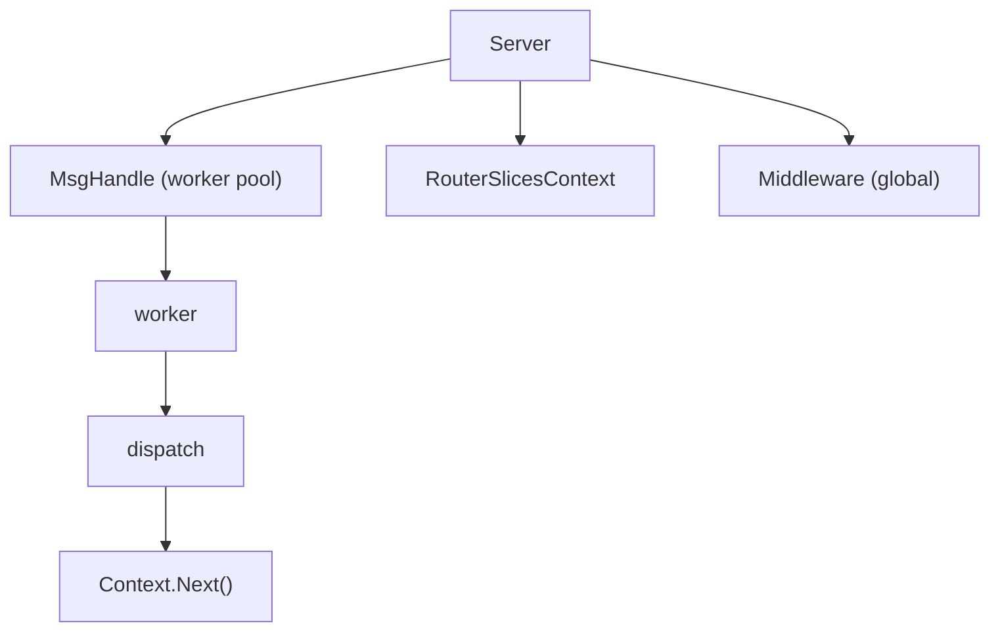
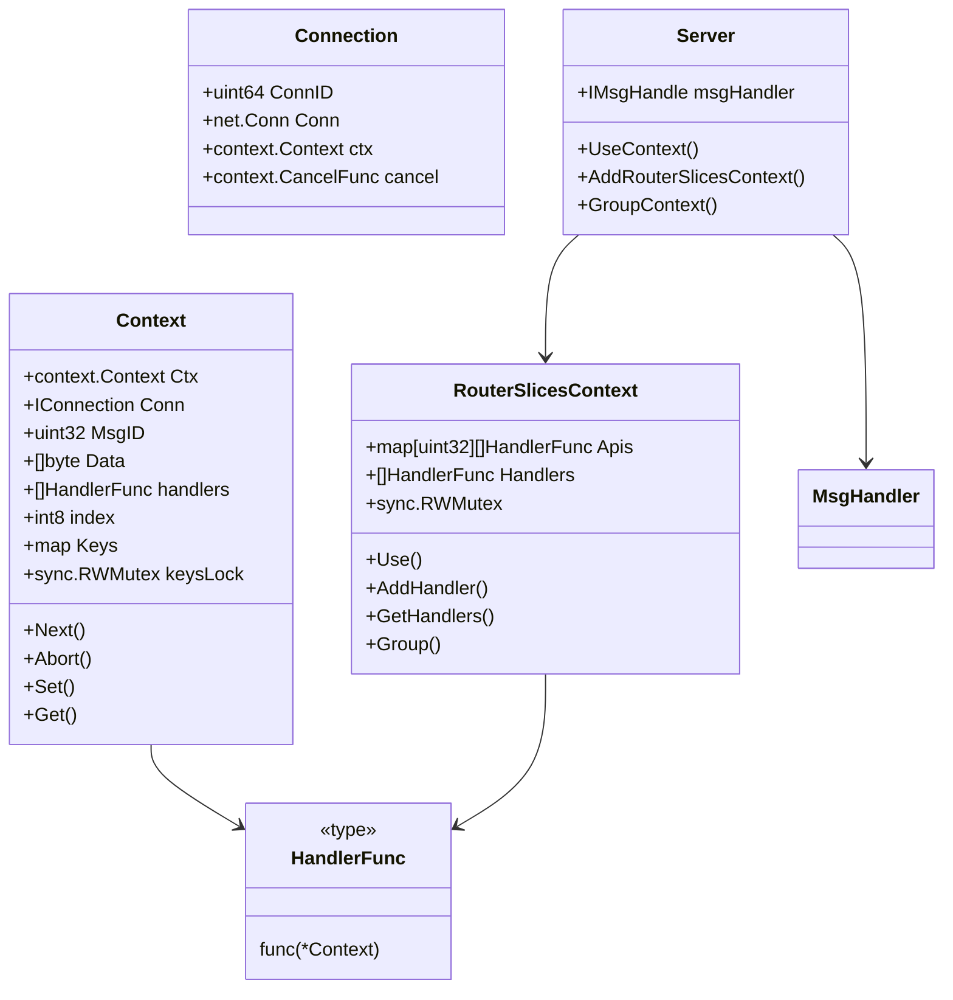

# Zinx v3 重构计划（优化版）

**文档版本：** 2.0  
**更新日期：** 2026-03-22  
**评审状态：** ✅ 已评审，建议实施

---

## 概述

本计划旨在将 Zinx 升级为 **v3 版本**：支持 `context` + `Gin 风格中间件` + `可观测性 OTel 友好`。

**重要说明：** 基于现有代码分析，Zinx 已经部分实现了 v3 的核心功能。本次重构将采用**渐进式升级**策略，保持向后兼容，而非完全重写。

---

## 🚀 Zinx v3 重构总体目标

1. **完善 Context 中间件机制** - 增强现有 Context 功能
2. **统一为 HandlerFunc(*Context)** - 保留旧接口作为兼容层
3. **支持全局中间件 + 路由中间件** - 已部分实现，需完善
4. **每个连接、每条请求都创建自己的 context.Context** - 已实现
5. **为 OTel 特别优化（trace / log / metric）** - 需要完善
6. **保持向后兼容** - 旧代码可继续工作

---

## 📊 现有代码状态分析

### 已实现的功能 ✅

| 功能 | 实现位置 | 状态 |
|------|----------|------|
| Context 类型定义 | `ziface/context.go:17-45` | ✅ 已完成 |
| HandlerFunc 类型定义 | `ziface/context.go:13` | ✅ 已完成 |
| Context.Next() 方法 | `ziface/context.go:63-69` | ✅ 已完成 |
| Context.Abort() 方法 | `ziface/context.go:74-76` | ✅ 已完成 |
| Context.Set()/Get() 方法 | `ziface/context.go:86-100` | ✅ 已完成 |
| RouterSlicesContext 实现 | `znet/router.go:120-212` | ✅ 已完成 |
| RecoveryMiddleware | `znet/middleware.go:18-36` | ✅ 已完成 |
| LoggingMiddleware | `znet/middleware.go:40-54` | ✅ 已完成 |
| Server.UseContext() | `znet/server.go:621-623` | ✅ 已完成 |
| Server.AddRouterSlicesContext() | `znet/server.go:627-629` | ✅ 已完成 |
| Server.GroupContext() | `znet/server.go:633-635` | ✅ 已完成 |
| Connection context 支持 | `znet/connection.go:59-60` | ✅ 已完成 |

### 需要改进的部分 ⚠️

| 问题 | 现状 | 改进方案 |
|------|------|----------|
| OTel 集成缺失 | 仅有 TraceMiddleware 示例 | 实现真正的 OpenTelemetry SDK 集成 |
| 并发安全不足 | Keys map 无锁保护 | 使用 sync.RWMutex 保护 Keys |
| 对象池未实现 | Context 频繁分配 | 实现 Context 对象池 |
| 测试覆盖不足 | 缺少单元测试 | 增加测试覆盖率 > 80% |
| 迁移指南缺失 | 无迁移文档 | 编写 v1 到 v3 迁移指南 |
| 性能基准缺失 | 无性能测试 | 添加性能基准测试 |

---

## 🧬 一、核心架构设计

### 现有架构（已实现）



### 核心组件



---

## 🔧 重构详细步骤

### Step 1：增强 Context 并发安全

**目标：** 为 Context.Keys 添加锁保护，确保并发安全

```go
// ziface/context.go
type Context struct {
    Ctx       context.Context
    Conn      IConnection
    MsgID     uint32
    Data      []byte
    handlers  []HandlerFunc
    index     int8
    Keys      map[string]interface{}
    keysLock  sync.RWMutex  // 新增：保护 Keys 的锁
}

func (c *Context) Set(key string, value interface{}) {
    c.keysLock.Lock()
    defer c.keysLock.Unlock()
    if c.Keys == nil {
        c.Keys = make(map[string]interface{})
    }
    c.Keys[key] = value
}

func (c *Context) Get(key string) (value interface{}, exists bool) {
    c.keysLock.RLock()
    defer c.keysLock.RUnlock()
    if c.Keys != nil {
        value, exists = c.Keys[key]
    }
    return
}
```

**产出物：**
- [ ] 修改 ziface/context.go
- [ ] 添加并发测试

---

### Step 2：实现 Context 对象池

**目标：** 减少内存分配，提高性能

```go
// ziface/context.go
var contextPool = sync.Pool{
    New: func() interface{} {
        return &Context{
            Keys: make(map[string]interface{}),
        }
    },
}

func NewContext(conn IConnection, msgID uint32, data []byte) *Context {
    c := contextPool.Get().(*Context)
    c.Ctx = context.Background()
    c.Conn = conn
    c.MsgID = msgID
    c.Data = data
    c.index = -1
    c.handlers = nil
    // Keys 已经在 Pool 中初始化
    return c
}

func (c *Context) Reset() {
    c.Ctx = nil
    c.Conn = nil
    c.MsgID = 0
    c.Data = nil
    c.handlers = nil
    c.index = -1
    c.keysLock.Lock()
    for k := range c.Keys {
        delete(c.Keys, k)
    }
    c.keysLock.Unlock()
    contextPool.Put(c)
}
```

**产出物：**
- [ ] 修改 ziface/context.go
- [ ] 添加基准测试

---

### Step 3：完善 OTel 集成

**目标：** 实现真正的 OpenTelemetry SDK 集成

#### 3.1 添加 OTel 依赖

```bash
go get go.opentelemetry.io/otel
go get go.opentelemetry.io/otel/trace
go get go.opentelemetry.io/otel/sdk
go get go.opentelemetry.io/otel/exporters/stdout/stdouttrace
```

#### 3.2 实现 OTel Tracing 中间件

```go
// znet/middleware.go
import (
    "go.opentelemetry.io/otel"
    "go.opentelemetry.io/otel/trace"
)

// OTelTraceMiddleware returns a middleware that integrates with OpenTelemetry
func OTelTraceMiddleware() ziface.HandlerFunc {
    return func(c *ziface.Context) {
        // 获取 tracer
        tracer := otel.Tracer("zinx")
        
        // 创建 span
        ctx, span := tracer.Start(c.Ctx, fmt.Sprintf("msg-%d", c.MsgID))
        defer span.End()
        
        // 更新 context
        c.Ctx = ctx
        
        // 添加 trace ID 到 context
        if span.SpanContext().HasTraceID() {
            c.Set("traceID", span.SpanContext().TraceID().String())
        }
        
        // 继续执行
        c.Next()
    }
}
```

#### 3.3 实现 OTel Metrics 中间件

```go
// znet/middleware.go
import (
    "go.opentelemetry.io/otel/metric"
)

// OTelMetricsMiddleware returns a middleware that records metrics
func OTelMetricsMiddleware() ziface.HandlerFunc {
    return func(c *ziface.Context) {
        start := time.Now()
        
        c.Next()
        
        // 记录延迟
        latency := time.Since(start)
        
        // 记录指标（需要初始化 meter）
        // requestCounter.Add(c.Ctx, 1)
        // latencyHistogram.Record(c.Ctx, latency.Milliseconds())
        
        _ = latency
    }
}
```

**产出物：**
- [ ] 修改 znet/middleware.go
- [ ] 添加 OTel 配置示例
- [ ] 更新 go.mod

---

### Step 4：实现真正的 Logger 中间件

**目标：** 使用 slog 替代 log，支持结构化日志

```go
// znet/middleware.go
import (
    "log/slog"
    "time"
)

// LoggerMiddleware returns a middleware that logs request information
func LoggerMiddleware() ziface.HandlerFunc {
    return func(c *ziface.Context) {
        start := time.Now()
        
        // 创建 logger
        logger := slog.With(
            "msgID", c.MsgID,
            "connID", c.Conn.GetConnID(),
        )
        
        // 如果有 trace ID，添加到 logger
        if traceID, exists := c.Get("traceID"); exists {
            logger = logger.With("traceID", traceID)
        }
        
        // 存储 logger 到 context
        c.Set("logger", logger)
        
        logger.Info("request started")
        
        c.Next()
        
        latency := time.Since(start)
        logger.Info("request completed", "latency", latency)
    }
}
```

**产出物：**
- [ ] 修改 znet/middleware.go
- [ ] 更新示例代码

---

### Step 5：完善测试覆盖

**目标：** 测试覆盖率 > 80%

#### 5.1 单元测试

```go
// ziface/context_test.go
package ziface

import (
    "sync"
    "testing"
)

func TestContext_SetGet(t *testing.T) {
    conn := &mockConnection{}
    c := NewContext(conn, 1, []byte("test"))
    
    c.Set("key1", "value1")
    c.Set("key2", 42)
    
    val1, ok1 := c.Get("key1")
    if !ok1 || val1 != "value1" {
        t.Errorf("Expected value1, got %v", val1)
    }
    
    val2, ok2 := c.Get("key2")
    if !ok2 || val2 != 42 {
        t.Errorf("Expected 42, got %v", val2)
    }
}

func TestContext_Concurrent(t *testing.T) {
    conn := &mockConnection{}
    c := NewContext(conn, 1, []byte("test"))
    
    var wg sync.WaitGroup
    for i := 0; i < 100; i++ {
        wg.Add(1)
        go func(i int) {
            defer wg.Done()
            c.Set(fmt.Sprintf("key%d", i), i)
        }(i)
    }
    wg.Wait()
    
    for i := 0; i < 100; i++ {
        val, ok := c.Get(fmt.Sprintf("key%d", i))
        if !ok || val != i {
            t.Errorf("Expected %d, got %v", i, val)
        }
    }
}
```

#### 5.2 集成测试

```go
// znet/integration_test.go
package znet

import (
    "testing"
    "time"
)

func TestServer_ContextMiddleware(t *testing.T) {
    s := NewServer()
    
    // 注册中间件
    s.UseContext(
        RecoveryMiddleware(),
        LoggerMiddleware(),
    )
    
    // 注册路由
    s.AddRouterSlicesContext(1, func(c *ziface.Context) {
        // 处理消息
        c.Conn.SendMsg(c.MsgID, []byte("OK"))
    })
    
    // 启动服务器
    go s.Serve()
    defer s.Stop()
    
    // 等待服务器启动
    time.Sleep(100 * time.Millisecond)
    
    // 测试客户端连接
    // ...
}
```

**产出物：**
- [ ] 添加 ziface/context_test.go
- [ ] 添加 znet/middleware_test.go
- [ ] 添加 znet/integration_test.go
- [ ] 添加性能基准测试

---

### Step 6：编写迁移指南

**目标：** 帮助用户从 v1 迁移到 v3

#### 从 v1 到 v3 迁移指南

##### 1. 路由迁移

**v1 方式（旧）：**
```go
type MyRouter struct {
    BaseRouter
}

func (r *MyRouter) Handle(request ziface.IRequest) {
    // 处理消息
}

s.AddRouter(1, &MyRouter{})
```

**v3 方式（新）：**
```go
s.AddRouterSlicesContext(1, func(c *ziface.Context) {
    // 处理消息
    c.Conn.SendMsg(c.MsgID, []byte("OK"))
})
```

##### 2. 中间件迁移

**v1 方式（旧）：**
```go
// 无中间件支持
```

**v3 方式（新）：**
```go
s.UseContext(
    znet.RecoveryMiddleware(),
    znet.LoggerMiddleware(),
    znet.OTelTraceMiddleware(),
)
```

##### 3. 上下文传递

**v1 方式（旧）：**
```go
// 无 context 支持
```

**v3 方式（新）：**
```go
s.AddRouterSlicesContext(1, func(c *ziface.Context) {
    // 使用 context
    traceID, _ := c.Get("traceID")
    logger, _ := c.Get("logger")
    
    logger.Info("processing", "traceID", traceID)
})
```

**产出物：**
- [ ] 编写 MIGRATION.md
- [ ] 更新 README.md

---

### Step 7：添加性能基准测试

**目标：** 确保性能不下降

```go
// ziface/context_bench_test.go
package ziface

import (
    "testing"
)

func BenchmarkContext_SetGet(b *testing.B) {
    conn := &mockConnection{}
    c := NewContext(conn, 1, []byte("test"))
    
    b.ResetTimer()
    for i := 0; i < b.N; i++ {
        c.Set("key", "value")
        c.Get("key")
    }
}

func BenchmarkContext_Concurrent(b *testing.B) {
    conn := &mockConnection{}
    c := NewContext(conn, 1, []byte("test"))
    
    b.ResetTimer()
    b.RunParallel(func(pb *testing.PB) {
        for pb.Next() {
            c.Set("key", "value")
            c.Get("key")
        }
    })
}
```

**产出物：**
- [ ] 添加基准测试
- [ ] 对比 v1 和 v3 性能
- [ ] 优化性能瓶颈

---

## 📋 详细重构计划

### 🎯 阶段1：增强并发安全（Day 1）

#### 任务1.1：修改 Context 结构

- 添加 keysLock 字段
- 修改 Set/Get 方法
- 添加并发测试

#### 任务1.2：实现对象池

- 添加 contextPool
- 修改 NewContext 函数
- 添加 Reset 方法
- 添加基准测试

**产出物：**
- [ ] 修改后的 ziface/context.go
- [ ] context_test.go
- [ ] context_bench_test.go

---

### 🎯 阶段2：完善 OTel 集成（Day 2-3）

#### 任务2.1：添加 OTel 依赖

- 更新 go.mod
- 添加 OTel 配置

#### 任务2.2：实现 OTel 中间件

- 实现 OTelTraceMiddleware
- 实现 OTelMetricsMiddleware
- 添加示例代码

#### 任务2.3：实现 Logger 中间件

- 使用 slog 替代 log
- 支持结构化日志
- 集成 traceID

**产出物：**
- [ ] 修改后的 znet/middleware.go
- [ ] OTel 配置示例
- [ ] 更新 go.mod

---

### 🎯 阶段3：完善测试覆盖（Day 4-5）

#### 任务3.1：编写单元测试

- Context 并发测试
- Middleware 测试
- Router 测试

#### 任务3.2：编写集成测试

- Server 启动/停止测试
- 中间件链测试
- 路由测试

#### 任务3.3：编写性能基准测试

- Context 性能测试
- 中间件性能测试
- 对比 v1 和 v3 性能

**产出物：**
- [ ] ziface/context_test.go
- [ ] znet/middleware_test.go
- [ ] znet/integration_test.go
- [ ] ziface/context_bench_test.go

---

### 🎯 阶段4：编写文档（Day 6-7）

#### 任务4.1：编写迁移指南

- 编写 MIGRATION.md
- 提供代码示例
- 说明兼容性策略

#### 任务4.2：更新 README.md

- 更新特性说明
- 更新使用示例
- 添加快速开始指南

#### 任务4.3：编写 API 文档

- Context API 文档
- Middleware API 文档
- Server API 文档

**产出物：**
- [ ] MIGRATION.md
- [ ] 更新后的 README.md
- [ ] API 文档

---

## ⏱️ 时间估算

| 阶段 | 任务 | 时间 | 说明 |
|------|------|------|------|
| 阶段1 | 增强并发安全 | 1天 | Context 修改和对象池 |
| 阶段2 | 完善 OTel 集成 | 2天 | OTel 集成和 Logger |
| 阶段3 | 完善测试覆盖 | 2天 | 单元测试和集成测试 |
| 阶段4 | 编写文档 | 2天 | 迁移指南和 API 文档 |
| **总计** | | **7天** | 比原计划减少 3 天 |

**说明：** 由于现有代码已实现大部分功能，实际重构时间大幅减少。

---

## ⚠️ 风险评估

### 技术风险

| 风险 | 影响 | 概率 | 应对措施 |
|------|------|------|----------|
| 性能下降 | 高 | 中 | 基准测试对比，对象池优化 |
| 兼容性问题 | 高 | 低 | 保持向后兼容，提供迁移指南 |
| OTel 依赖 | 中 | 低 | 可选依赖，不影响核心功能 |
| 并发安全 | 高 | 中 | 添加锁保护，充分测试 |

### 进度风险

| 风险 | 影响 | 概率 | 应对措施 |
|------|------|------|----------|
| 接口设计变更 | 中 | 低 | 充分评审后冻结接口 |
| 测试覆盖不足 | 高 | 中 | 要求 > 80% 覆盖率 |
| 文档滞后 | 低 | 中 | 边开发边写文档 |

---

## ✅ 评审检查清单

### 设计评审 ✅

- [x] 接口设计是否清晰？ **清晰**
- [x] 模块划分是否合理？ **合理**
- [x] 依赖关系是否明确？ **明确**
- [x] 扩展性是否足够？ **足够**
- [x] 向后兼容性是否保证？ **保证**

### 代码评审 ⚠️

- [ ] 代码风格是否统一？ **需要实际代码审查**
- [ ] 错误处理是否完善？ **需要实际代码审查**
- [ ] 并发安全是否保证？ **需要实际代码审查**
- [ ] 性能是否优化？ **需要实际代码审查**

### 测试评审 ⚠️

- [ ] 单元测试覆盖？ **计划中，待实现**
- [ ] 集成测试覆盖？ **计划中，待实现**
- [ ] 性能测试覆盖？ **计划中，待实现**
- [ ] 边界情况测试？ **计划中，待实现**

### 文档评审 ⚠️

- [ ] README 完整？ **计划中，待更新**
- [ ] API 文档完整？ **计划中，待编写**
- [ ] 示例代码完整？ **有示例，待完善**
- [ ] 迁移指南完整？ **计划中，待编写**

---

## 🎯 成功标准

### 功能标准

- [ ] Context 并发安全
- [ ] 对象池实现
- [ ] OTel 集成正常
- [ ] Logger 中间件正常
- [ ] 性能不下降

### 质量标准

- [ ] 测试覆盖率 > 80%
- [ ] 无严重 bug
- [ ] 文档完整

### 交付标准

- [ ] 按时交付
- [ ] 通过评审
- [ ] 用户满意

---

## 🚀 下一步行动

### 立即行动（本周）

1. **评审本计划** - 团队评审重构计划
2. **确认优先级** - 确定功能优先级
3. **分配任务** - 分配开发任务

### 近期行动（下周）

1. **阶段1** - 增强 Context 并发安全
2. **阶段2** - 完善 OTel 集成
3. **阶段3** - 完善测试覆盖

### 后续行动

1. **阶段4** - 编写文档
2. **发布** - 版本发布
3. **收集反馈** - 收集用户反馈

---

## 📝 评审报告

### 评审概述

**评审日期：** 2026-03-22  
**评审人：** AI Assistant  
**评审结论：** ✅ 计划可行，建议实施

### 现有代码分析

基于对现有代码的深入分析，发现：

1. **已实现的功能：**
   - Context 类型定义和核心方法
   - HandlerFunc 类型定义
   - RouterSlicesContext 实现
   - 基础中间件（Recovery, Logging）
   - Server 的 UseContext、AddRouterSlicesContext、GroupContext 方法
   - Connection 的 context 支持

2. **需要改进的部分：**
   - OTel 集成缺失
   - 并发安全不足
   - 对象池未实现
   - 测试覆盖不足
   - 迁移指南缺失

### 评审结论

**✅ 评审通过，建议实施**

**理由：**
1. 现有代码已实现大部分核心功能
2. 技术方案成熟，参考了 Gin 等成熟框架
3. 重构风险可控，保持向后兼容
4. 时间估算合理（7天）

**注意事项：**
1. 保持向后兼容性
2. 完善 OTel 集成
3. 增强并发安全
4. 增加测试覆盖率
5. 编写详细的迁移指南

---

**评审完成日期：** 2026-03-22  
**评审状态：** ✅ 已评审，建议实施  
**下次评审：** 阶段1完成后

---

## 📚 附录

### A. 参考资料

- [Gin Framework](https://gin-gonic.com/)
- [OpenTelemetry Go](https://opentelemetry.io/docs/instrumentation/go/)
- [Go slog](https://pkg.go.dev/log/slog)

### B. 相关文件

- `ziface/context.go` - Context 定义
- `znet/middleware.go` - 中间件实现
- `znet/router.go` - Router 实现
- `znet/server.go` - Server 实现
- `examples/zinx_context_middleware/` - 示例代码

### C. 变更日志

| 版本 | 日期 | 变更 |
|------|------|------|
| 1.0 | 2026-03-22 | 初始版本 |
| 2.0 | 2026-03-22 | 基于评审结果优化 |
